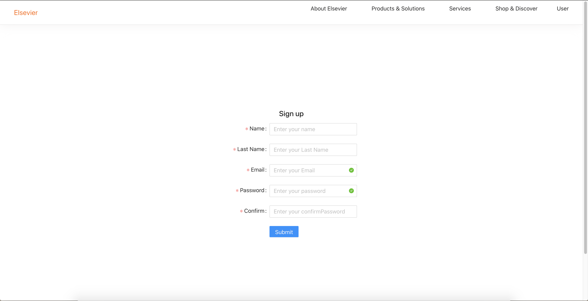
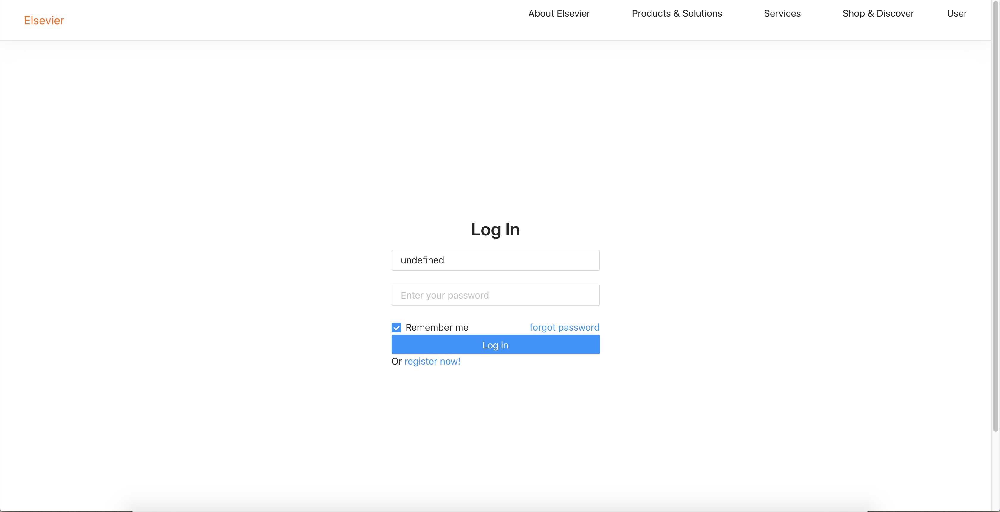
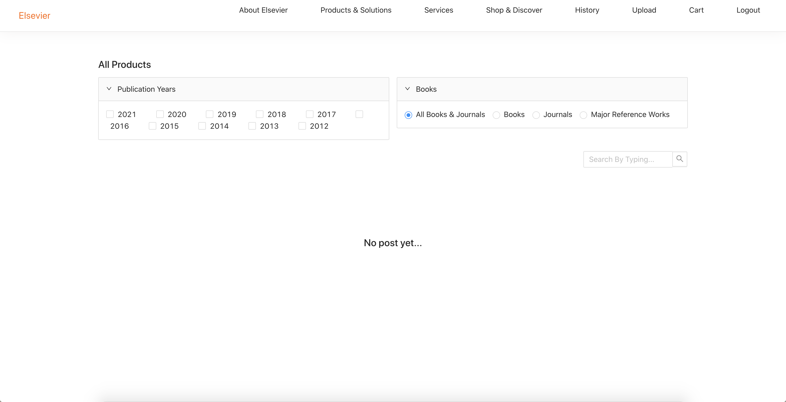
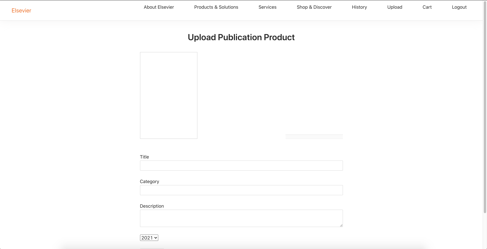
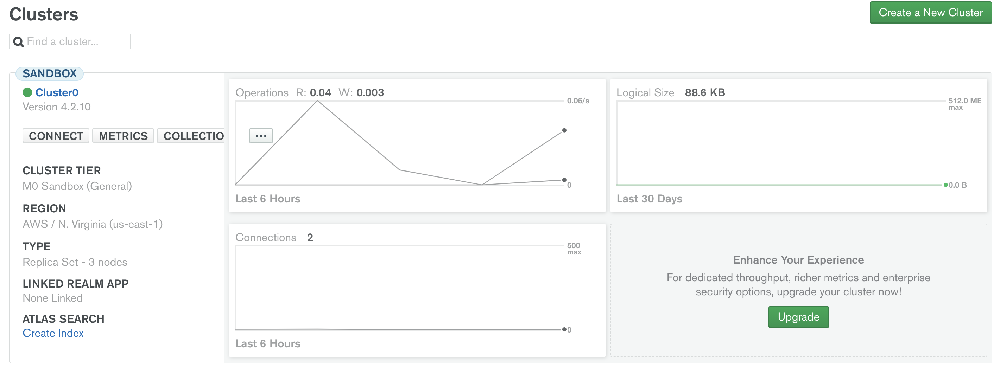

<!--
 * @Author: Jinqi Li
 * @Date: 2020-10-11 01:48:46
 * @LastEditors: Jinqi Li
 * @LastEditTime: 2020-11-02 16:25:22
 * @FilePath: /PoC/README.md
-->
# PoC
## BookStore Demo
#### Online bookstore with user management, uploading products, shopping and security payment modules.
## Installation & Usage
* #### Replace the mongoDB info in </server/config/dev.js> file
* #### `yarn` under the root directory
* #### `yarn` under the client directory
* #### `node index` under the server directory
* #### `yarn run start` under the client directory
## Demo Images

## [Code](1-BookStore)
## [Live Demo]() (building)